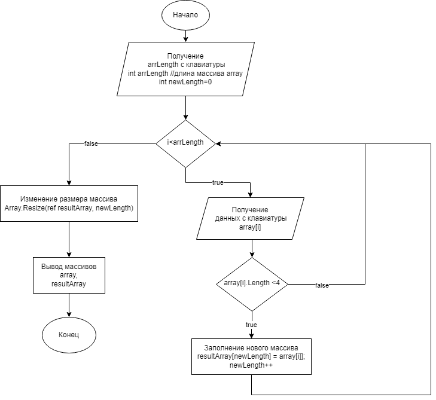

# Итоговая проверочная работа 
##  testwork1

> **Задание**: 

Написать программу, которая из имеющегося массива строк формирует массив из строк, длина которых меньше либо равна 3.

> **Пошаговый алгоритм**  
1. Запрашиваем длину строкового массива 
2. Объявляем два строковых массива указанной длинны
3. В цикле **for** заполняем исходный массив, запрашивая данные
4. Проверяем введенное значение и, если оно соответствует условию _(меньше или равно 3)_, записываем его в результирующий массив, ведем счетчик записанных значений.
5. Так как во втором массиве количество элементов меньше или равно количеству элементов в первом, обрезаем второй массив, используя значение счетчика
6. Выводим значения исходного массива и нового массива 

----

> **Блок-схема процесса**  

 
---
